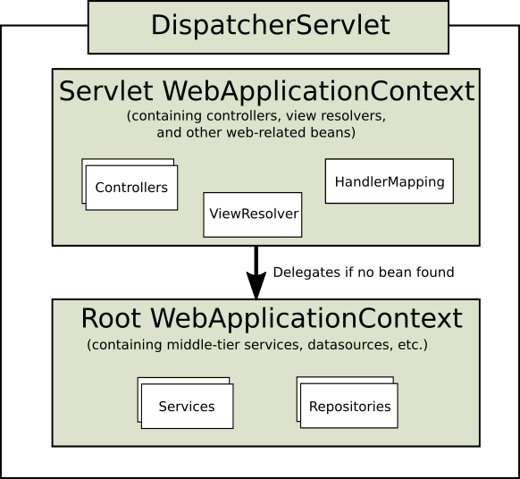

# Servlet Archaeology

[](https://github.com/jabrena/servlet-archaeology/actions/workflows/build.yaml)

[](https://sonarcloud.io/summary/new_code?id=jabrena_servlet-archaeology)

## Motivation
Spring Boot is an exceptional solution built upon the foundation of the Spring Framework, greatly simplifying the daily tasks of software engineers. However, there are instances when comprehending certain decisions made within Spring Boot requires delving beneath the surface. This repository serves precisely that purpose – shedding light on these intricacies.

## Servlet evolution

Presently, I am keen on gaining a deeper understanding of the dynamic interplay between a Servlet container, such as Tomcat, and the intricate mechanics of the Spring Framework.



```bash
make help
make servlet
make spring-framework-jsp2
make spring-framework-mvc
make spring-framework-mvcfn
make spring-boot-1
make spring-boot-2
make spring-boot-3
make spring-boot-4
make spring-boot-5
make spring-boot-6
make spring-boot-7
make spring-boot-8
make spring-boot-9
make spring-boot-10
make spring-boot-11

open http://localhost:8080/hello
curl http://localhost:8080/hello
kill $(lsof -t -i:8080)
```
## References

- https://tomcat.apache.org/
- https://docs.spring.io/spring-framework/reference/web/webmvc.html
- https://github.com/spring-projects/spring-boot/tree/main/spring-boot-project/spring-boot-autoconfigure/src/main/java/org/springframework/boot/autoconfigure
- https://dunwu.github.io/spring-tutorial/pages/20287b/#%E7%AE%80%E4%BB%8B
- https://github.com/cckmit/Java_notes/tree/master/02.spring%E5%AE%B6%E6%97%8F%E6%A1%86%E6%9E%B6/SpringCode_%20senior_heima/show/src/main/java/com/itheima
- https://github.com/dsyer/spring-boot-micro-apps/tree/main
- https://github.com/spring-projects-experimental/spring-boot-thin-launcher
